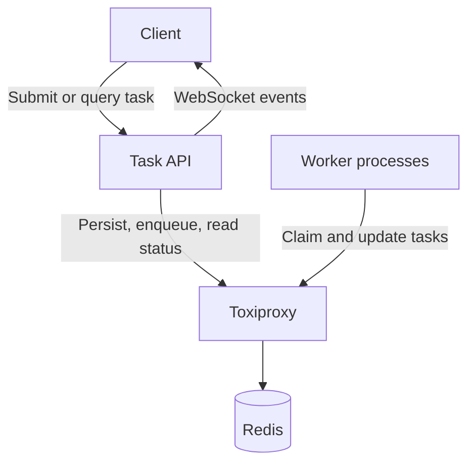
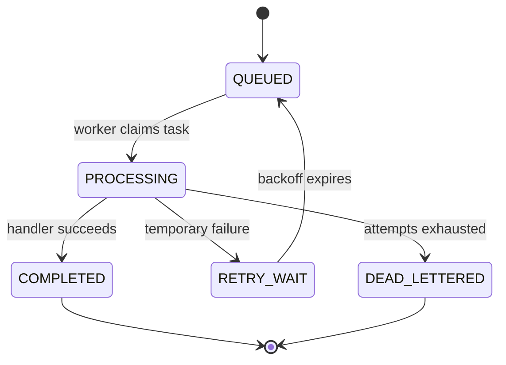

# Distributed Task Queue

A fault-tolerant background task-processing system built with Java, Spring Boot, Redis Streams, and Docker.


## Why this project exists

Long-running work such as report generation, file processing, data imports, and external API calls
should not block an HTTP request. Running that work directly inside the request creates several
problems:

- requests can time out;
- traffic spikes can exhaust server resources;
- a process crash can lose in-memory work;
- failures lack a consistent retry policy;
- API and worker capacity cannot scale independently;
- clients need a reliable way to observe progress.

This project separates accepting work from executing work:

```
Client submits task -> API persists and queues it -> Worker processes it asynchronously
```

The API returns `202 Accepted` with a task ID. Workers process tasks independently and publish each
lifecycle transition.

## Why separate API and worker processes?

A single Spring Boot process could use an in-memory `BlockingQueue` and `ExecutorService`. That
design offers simpler and faster communication because API and worker threads share memory.

This project deliberately trades that simplicity for stronger operational properties:

| Single process | Separate API and worker processes |
| --- | --- |
| In-memory communication | Network communication through Redis |
| Simpler deployment | More infrastructure and coordination |
| API and workers scale together | API and workers scale independently |
| A process failure affects both roles | Worker failure does not stop the API |
| In-memory work can disappear | Confirmed tasks are stored durably |

Redis acts as the shared communication and coordination layer:

```
API process -> TCP -> Redis <- TCP <- Worker processes
```

Concurrency still exists inside every worker. Multiple worker processes provide distribution, while
multiple threads inside each worker provide local parallelism.

## Target architecture



All Java-to-Redis traffic passes through Toxiproxy during development so latency, timeouts, and
disconnects can be injected reproducibly.

## Maven modules

This is one Git repository containing reusable libraries and two independently runnable Spring Boot
applications:

```
distributed-task-queue/
├── pom.xml                  Root Maven build coordinator
├── compose.yaml             Local container environment
├── task-model/              Shared plain-Java task definitions
├── task-redis/              Redis keys, repositories, and Lua transitions
├── task-api/                Spring Boot HTTP and WebSocket application
└── task-worker/             Spring Boot background worker application
```

| Module | Responsibility | Runnable process? | Present |
| --- | --- | --- | --- |
| Root POM | Coordinates versions, modules, plugins, and build order | No | yes |
| `task-model` | Task, state, type, retry policy, and failure metadata | No | yes |
| `task-redis` | Redis persistence and atomic state transitions | No | planned |
| `task-api` | Submission, status queries, and client events | Yes | scaffolded |
| `task-worker` | Consumption, execution, retries, and recovery | Yes | planned |

Separate POM files give each module a clear dependency boundary. For example, the model does not
need an HTTP server, and the worker does not need web-controller dependencies.

## Task lifecycle



The model rejects illegal transitions such as:

```
QUEUED -> COMPLETED
COMPLETED -> PROCESSING
DEAD_LETTERED -> QUEUED
```

## Redis data structures

| Requirement | Redis structure | Reason |
| --- | --- | --- |
| Ready tasks | Stream with consumer group | Durable delivery, acknowledgements, and pending-task recovery |
| Current task state | Hash per task | Efficient status lookup and field updates |
| Delayed retries | Sorted set | Orders tasks by their next-attempt timestamp |
| Dead letters | Dedicated Stream | Preserves failed tasks and structured failure metadata |
| Live notifications | Pub/Sub | Low-latency event delivery |
| Missed notification recovery | Durable event Stream | Replays events after a client reconnects |

Critical state transitions will use Redis Lua scripts so related updates happen atomically. For
example, submitting a task must persist its state and enqueue it as one logical operation.

## Processing guarantees

The system targets **at-least-once** processing.

A worker might complete an external side effect and crash before acknowledging the Redis message.
Another worker can then reclaim and execute the task again. Task handlers must therefore be
idempotent and use the task ID as an idempotency key where appropriate.

The project does not claim exactly-once execution.

## Building and running

The toolchain lives in a container, so Maven and a JDK are not needed on the host.

```bash
cp .env.example .env          # first time only
docker compose run --rm dev mvn verify
```

For an interactive shell inside the build container:

```bash
docker compose run --rm dev bash
```

## Technology choices

| Technology | Purpose |
| --- | --- |
| Java 21 | Application code, records, concurrency, and worker execution |
| Spring Boot | Configuration, dependency injection, HTTP API, lifecycle, and Redis integration |
| Maven | Multi-module builds, dependency management, testing, and packaging |
| Redis Streams | Durable queue and consumer coordination |
| Redis Hashes | Current task state |
| Redis Sorted Sets | Delayed retries |
| WebSockets | Live client updates |
| Toxiproxy | Controlled latency and connection-failure experiments |
| Docker Compose | Reproducible local runtime |
| JUnit 5 | Automated behavioral tests |
